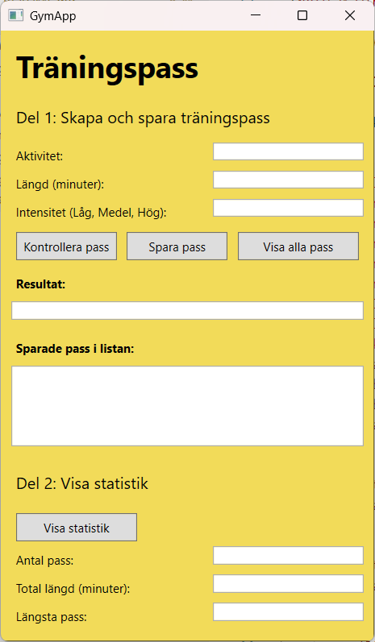
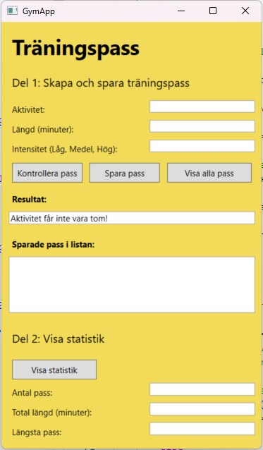
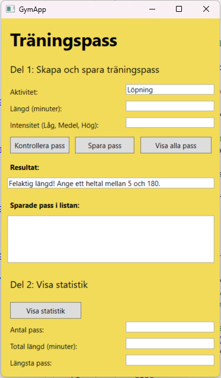
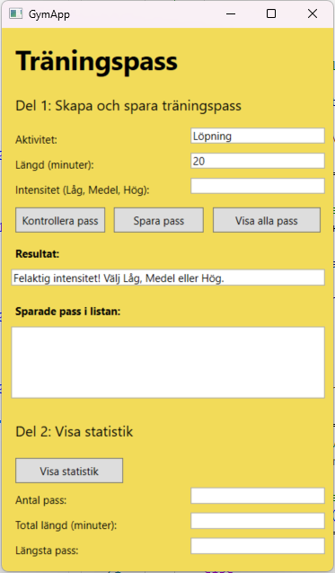
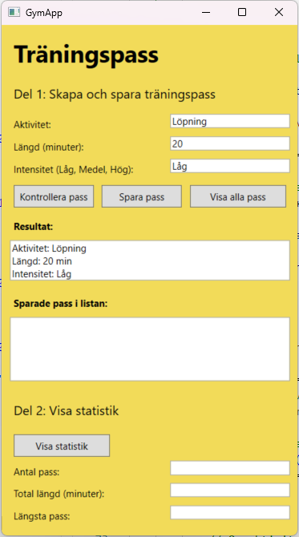
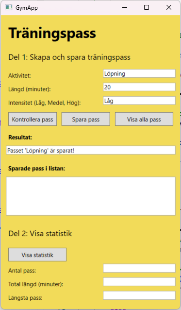
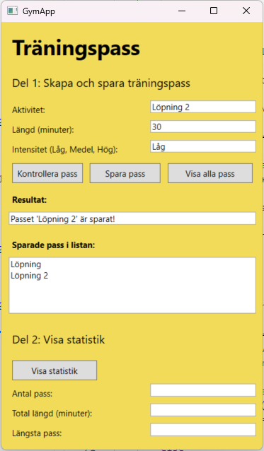
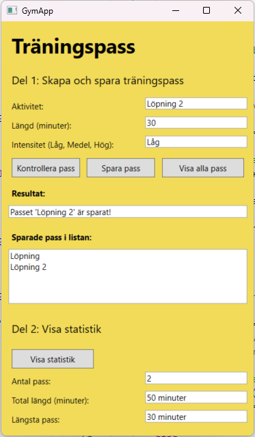

# Prov-wpf-E2

> **Viktigt!**  
> Stäng av tillägget **C# Dev Kit** och starta om **VS Code**

## Uppgift

Du ska skapa en Parkeringsapp som ser ut som nedan.

* Öppna terminalen **Ctrl + Ö**, skriv och kör:
```shell
.\net9.0-windows\GymApp.exe
```


### Tips till XAML-ayouten

* Grundstrukturen till layouten ser ut såhär:

```xml
<Window x:Class="GymApp.MainWindow"
        xmlns="http://schemas.microsoft.com/winfx/2006/xaml/presentation"
        xmlns:x="http://schemas.microsoft.com/winfx/2006/xaml"
        xmlns:d="http://schemas.microsoft.com/expression/blend/2008"
        xmlns:mc="http://schemas.openxmlformats.org/markup-compatibility/2006"
        xmlns:local="clr-namespace:GymApp"
        mc:Ignorable="d"
        Title="GymApp" SizeToContent="WidthAndHeight"
        Background="#f2db59">
    <StackPanel Margin="10">
        <Label Content="Träningspass" FontSize="30" FontWeight="Bold" Margin="0,0,0,10"/>
        <Label Content="Del 1: Skapa och spara träningspass" FontSize="16" Margin="0,0,0,10"/>
        <StackPanel Orientation="Horizontal">
            <Label Width="200" Content="Aktivitet:"/>
            <TextBox Width="150" Name="txbAktivitet" Margin="0,0,0,10"/>
        </StackPanel>
        <StackPanel Orientation="Horizontal">
            <Label Width="200" Content="Längd (minuter):"/>
            <TextBox Width="150" Name="txbLangd" Margin="0,0,0,10"/>
        </StackPanel>
        <StackPanel Orientation="Horizontal">
            <Label Width="200" Content="Intensitet (Låg, Medel, Hög):"/>
            <TextBox Width="150" Name="txbIntensitet" Margin="0,0,0,10"/>
        </StackPanel>
        <StackPanel Orientation="Horizontal">
            <Button Content="Kontrollera pass" Click="KlickVisa" Width="100" Margin="5" Padding="5"/>
            <Button Content="Spara pass" Click="KlickSpara" Width="100" Margin="5" Padding="5"/>
            <Button Content="Visa alla pass" Click="KlickVisaPass" Width="120" Margin="5" Padding="5"/>
        </StackPanel>
        <Label Content="Resultat:" FontWeight="Bold" Margin="0,5,0,5"/>
        <TextBox Name="txbPass" Margin="0,0,0,10" IsReadOnly="True"/>
        <Label Content="Sparade pass i listan:" FontWeight="Bold" Margin="0,5,0,5"/>
        <TextBox Name="txbLista" Height="80" IsReadOnly="True"/>

        <Label Content="Del 2: Visa statistik" FontSize="16" Margin="0,20,0,10"/>
        <Button Content="Visa statistik" Click="KlickVisaStatistik" Width="120" Margin="5" Padding="5" HorizontalAlignment="Left"/>
        <StackPanel Orientation="Horizontal">
            <Label Width="200" Content="Antal pass:"/>
            <TextBox Width="150" Name="txbAntalPass" Margin="0,0,0,10" IsReadOnly="True"/>
        </StackPanel>
        <StackPanel Orientation="Horizontal">
            <Label Width="200" Content="Total längd (minuter):"/>
            <TextBox Width="150" Name="txbTotalMinuter" Margin="0,0,0,10" IsReadOnly="True"/>
        </StackPanel>
        <StackPanel Orientation="Horizontal">
            <Label Width="200" Content="Längsta pass:"/>
            <TextBox Width="150" Name="txbMaxMinuter" Margin="0,0,0,10" IsReadOnly="True"/>
        </StackPanel>
    </StackPanel>
</Window>
```

### Del 1
* Användaren ska kunna mata in:
  * **Aktivitet**
  * **Längd** (minuter)
  * **Intensitet** (Låg, Medel, Hög)
* Användaren ska kunna trycka på knappen **Kontrollera pass** och en sammanfattning visas.

* Om **Aktivitet** är tom ska en varning visas.
* Om **Längd** inte är ett heltal eller inom 5–180 minuter ska en varning visas.
* Om **Intensitet** inte är Låg, Medel eller Hög ska en varning visas.

### Del 2
* Användaren ska kunna trycka på knappen **Visa Statistik** och statistik visas:
  * Antal pass
  * Total längd (minuter)
  * Längsta pass

## OBS!
* Du får bara titta på [C# snabbreferens](https://csharp.progdocs.se/lathund-wpf)
* Ej tillåtet: 
  * Hjälp under provets gång från någon annan än lärare.  
  * AI-verktyg (ChatGPT, Copilot mfl), alla chattprogram och liknande (Discord, Steam mfl). 
  * Alla webbläsarflikar ska stängas ned.
* Öppna en ny terminalen **Ctrl + Skift + Ö** och skapa kodfilerna: 
```shell
dotnet new console
```
* Kommentera din kod och indentera din kod så den är tydlig att följa.
* **Kom ihåg**: Ta en del i taget och fokusera på den innan du går vidare. Det är bättre att lösa någon del helt än att lösa flera till hälften.

## Exempel på programkörning

### Ange Aktivitet



### Ange Längd



### Ange Intensitet



### Inmatning är korrekt



### Spara pass



### Visa alla pass



### Visa statistik

